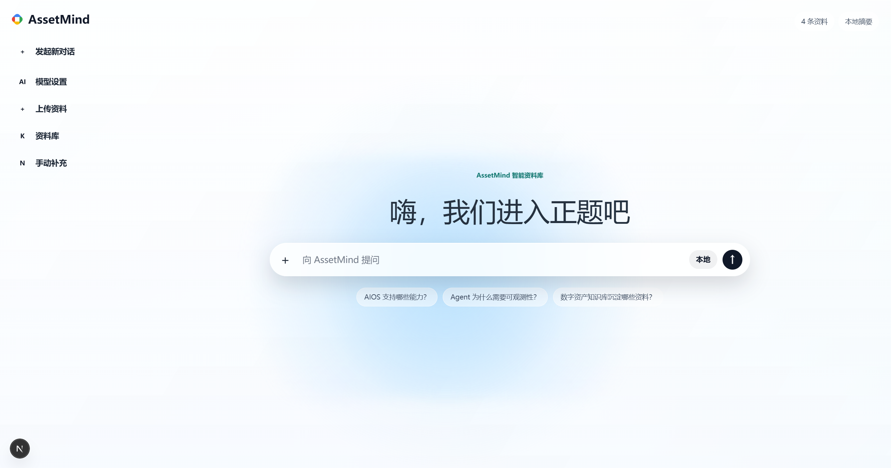
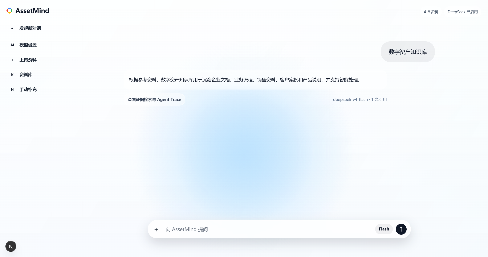
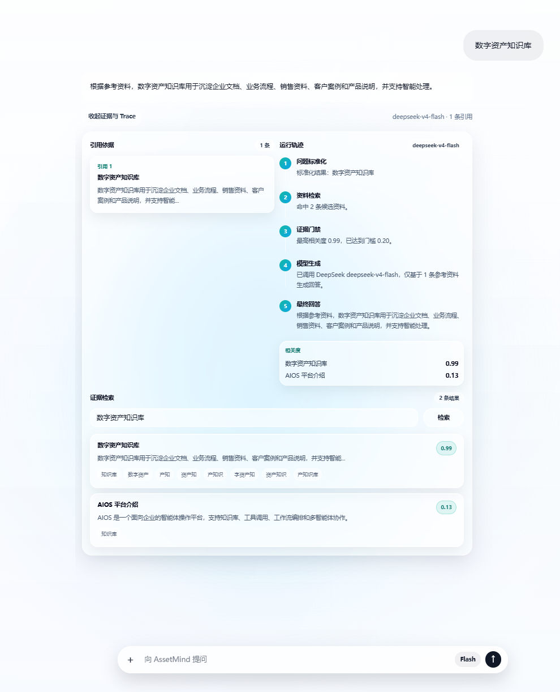
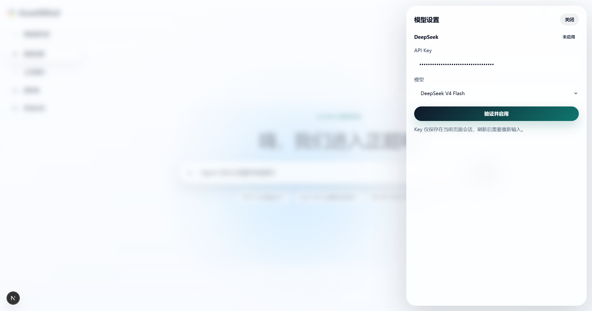
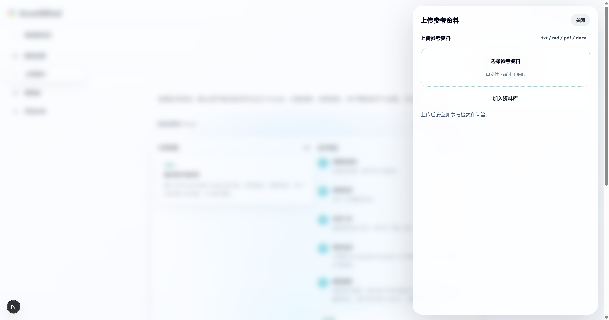
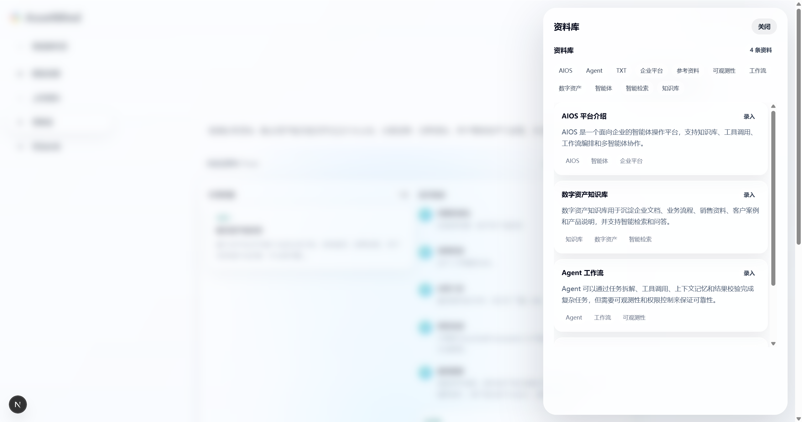

# AssetMind 智能资料库

AssetMind 是一个面向中国用户的知识资产问答工作台。项目围绕“知识资产列表 - 新增资产 - 检索 - Agent 问答 - 引用来源 - Agent Trace”构建完整闭环，同时支持上传参考资料和用户自行输入 DeepSeek API Key 启用真实 AI 能力。



## 功能概览

- 知识资产列表：展示标题、正文摘要、标签、来源和资料数量。
- 新增知识资产：支持手动录入 Title、Content、Tags。
- 参考资料上传：支持 `.txt`、`.md`、`.pdf`、`.docx`，单文件上限 10MB。
- 简单检索：基于关键词、业务词和字段权重返回 top 3 相关资料。
- Agent 问答：先检索知识资产，再基于命中资料生成回答和引用。
- DeepSeek 接入：用户在前端输入 Key，验证后启用真实模型能力。
- Agent Trace：展示 Query、Retrieved Assets、Scores、Final Answer 和模型调用状态。
- 中文 UI/UX：首页采用清爽问答入口，工具功能收纳在左侧导航，回答后可展开证据检索与 Agent Trace。

## 笔试要求对照

| 要求 | 实现位置 |
| --- | --- |
| 展示知识资产列表 | 左侧“资料库”工具面板，`GET /api/assets` |
| 支持新增知识资产 | “手动补充”工具面板，`POST /api/assets` |
| 支持检索知识资产 | 回答后的“证据检索与 Agent Trace”，`POST /api/search` |
| 支持用户向 Agent 提问 | 首页问答输入框，`POST /api/ask` |
| Agent 根据检索结果返回答案 | `lib/agent.ts` 串联检索、证据选择和回答生成 |
| 展示回答和引用来源 | 回答区和证据展开区 |
| 展示 Agent Trace / 检索过程 | 证据展开区中的“运行轨迹” |
| 清晰、克制、有质感的 UI | Gemini 风格首页 + 液态玻璃面板 |

## 技术栈

- Next.js 16 App Router
- React 19
- TypeScript
- Tailwind CSS 4
- Next API Route
- 本地 JSON 文件存储
- DeepSeek OpenAI 兼容接口
- `pdf-parse`、`mammoth` 用于资料文本提取

## 本地运行

```powershell
npm install
npm run dev
```

默认访问：

```text
http://127.0.0.1:3000
```

常用检查：

```powershell
npm run lint
npm run build
```

## 使用流程

1. 打开首页，在问答框中直接提问。
2. 点击左侧“资料库”查看内置资产。
3. 点击“手动补充”新增知识资产。
4. 点击“上传资料”上传 `.txt`、`.md`、`.pdf` 或 `.docx` 参考资料。
5. 点击“模型设置”输入 DeepSeek API Key，验证成功后启用真实模型。
6. 提问后点击“查看证据检索与 Agent Trace”，查看引用、检索结果、分数和运行轨迹。





## API 设计

- `GET /api/assets`: 获取知识资产列表。
- `POST /api/assets`: 手动新增知识资产。
- `POST /api/assets/upload`: 上传参考资料并写入资料库。
- `POST /api/search`: 检索 top 3 相关资料。
- `POST /api/llm/validate`: 验证 DeepSeek API Key。
- `POST /api/ask`: 基于资料库问答，可携带当前会话中的 DeepSeek Key。

统一响应结构：

```ts
type ApiSuccess<T> = {
  data: T;
};

type ApiError = {
  error: string;
};
```

## 数据结构设计

题目要求的核心结构是：

```ts
type KnowledgeAsset = {
  id: string;
  title: string;
  content: string;
  tags: string[];
  createdAt: string;
};
```

本项目在此基础上增加了可选的 `source` 字段，用于记录上传资料来源；旧数据不需要迁移。

```ts
type KnowledgeAsset = {
  id: string;
  title: string;
  content: string;
  tags: string[];
  createdAt: string;
  source?: {
    type: "manual" | "upload";
    fileName?: string;
    mimeType?: string;
    size?: number;
  };
};
```

设计取舍：

- `id` 使用 `crypto.randomUUID()`，避免标题变化影响引用关系。
- `title` 用于列表展示和高权重检索。
- `content` 是回答生成和引用片段的主要来源。
- `tags` 用于检索加权和用户快速理解资料分类。
- `createdAt` 便于排序、审计和后续增量同步。
- `source` 用于区分手动录入和上传资料，并保留文件名、类型和大小。

## 存储方案取舍

当前使用 `data/knowledge-assets.json` 作为本地 JSON 文件存储。

选择原因：

- 本地演示成本低，评审者无需准备数据库。
- 数据刷新或重启 dev server 后仍保留。
- 文件结构直观，便于解释数据模型和读写边界。

限制：

- 不适合高并发写入。
- 不适合无持久文件系统的 Serverless 部署。
- 缺少事务、权限、审计、备份和数据迁移能力。

## 检索实现

当前检索不是向量检索，而是可解释的轻量关键词检索。

流程：

1. Query normalization：统一大小写、清理空白、保留中文/英文/数字。
2. Tokenization：英文按词切分，中文优先保留业务词，并补充短 n-gram。
3. 字段加权：
   - title 权重最高；
   - tags 次之；
   - content 作为基础召回。
4. 生成 `score`、`snippet`、`matchedTerms`。
5. 按分数排序返回 top 3。

返回结构：

```ts
type SearchResult = {
  assetId: string;
  title: string;
  snippet: string;
  score: number;
  matchedTerms: string[];
};
```

为什么这样设计：

- 可解释，能在 Trace 中展示命中词和分数。
- 无需 embedding key 或向量数据库，便于本地运行。
- 足以展示 RAG 链路意识和工程边界。

## Agent 问答与 Trace

问答流程：

```text
用户问题
  ↓
检索 top 3 相关知识资产
  ↓
判断是否有足够引用依据
  ↓
基于命中资料生成回答，或在无资料时使用 DeepSeek 通用回答
  ↓
展示答案、引用来源、检索结果和 Agent Trace
```

Trace 展示内容：

- Query：用户问题。
- Retrieved Assets：命中的知识资产。
- Scores：相似度分数。
- Final Answer：最终答案。
- Model Generation：本地摘要、DeepSeek 基于资料回答或 DeepSeek 通用回答。

回答策略：

- 有相关资料时：优先基于检索结果回答，并展示引用来源。
- 无相关资料但已启用 DeepSeek：使用通用 AI 回答，引用为 0。
- 无相关资料且未启用 DeepSeek：提示用户配置 Key 或上传相关资料。

## DeepSeek Key 安全说明

- Key 只保存在当前 React 页面状态中。
- Key 不写入 `localStorage`。
- Key 不写入本地 JSON。
- Key 不写入环境变量或日志。
- 刷新页面后 Key 会丢失，需要重新输入。
- 服务端只在验证和问答请求中临时使用 Key 转发到 DeepSeek。

默认模型是 `deepseek-v4-flash`，也可以选择 `deepseek-v4-pro`。



## 上传资料限制

- 支持：`.txt`、`.md`、`.pdf`、`.docx`
- 单文件上限：10MB
- 文本和 Markdown 直接读取。
- PDF 使用 `pdf-parse` 提取文本。
- DOCX 使用 `mammoth` 提取纯文本。
- 扫描版 PDF 或图片型文档无法提取有效文本，需要先 OCR。
- 当前上传文件会转成单条知识资产，不做 chunking 或向量化。





## 如果接入真实向量数据库，会如何改造？

会把当前 `lib/retrieval.ts` 拆成检索接口和具体实现：

1. 资产写入时做 chunking，把长文档切成稳定片段。
2. 对每个 chunk 调用 embedding 模型。
3. 将向量和元数据写入向量数据库，例如 pgvector、Milvus、Qdrant 或 Pinecone。
4. 查询时先做向量召回，再叠加关键词过滤、权限过滤和 rerank。
5. `SearchResult` 对 UI 保持兼容，继续返回 `assetId`、`title`、`snippet`、`score`。
6. Agent Trace 增加 embedding model、topK、rerank score、过滤原因等可观测信息。

## 如果支持多租户，会如何改造？

需要从数据模型、接口层、检索层和日志层同时加入租户隔离：

- `KnowledgeAsset` 增加 `tenantId`。
- 所有 API 从认证上下文解析 tenant，而不是信任前端传参。
- 存储层所有读写都按 tenant 过滤。
- 向量索引按 tenant 隔离，或在检索时强制 tenant filter。
- 引用、Trace、错误信息和日志都不能泄露其他租户资料。
- 后台任务、上传解析、embedding 队列也必须携带 tenant 上下文。

## 真实 ToB 场景最担心的问题

最担心的是权限与引用可信度。

RAG 系统在企业场景中最容易出现两类高风险问题：

- 权限泄露：用户无权访问的资料被召回进上下文，模型再把内容泄露到回答中。
- 引用不可信：回答看起来合理，但引用不支持结论，业务用户无法追责。

真实上线前需要补齐：

- 登录和权限模型。
- 租户隔离。
- 检索前权限过滤。
- 敏感字段脱敏。
- 审计日志。
- 资料版本管理。
- 引用校验和人工反馈闭环。

## 未完成事项

- 未实现登录、权限、多租户和审计。
- 未接入 embedding 和真实向量数据库。
- 未实现 chunking、OCR、批量上传和上传队列。
- 未实现资产编辑、删除和版本管理。
- 未实现流式回答和多轮对话历史。
- 未增加端到端测试。

## 后续迭代计划

1. 增加资产编辑、删除、批量导入和上传进度。
2. 引入 chunking、embedding 和向量数据库。
3. 增加权限过滤、多租户隔离和审计日志。
4. 增加 OCR、资料版本管理和引用校验。
5. 增加流式回答、多轮对话和用户反馈闭环。
6. 增加 Playwright 端到端测试和更完整的错误监控。

## 项目结构

```text
app/
  api/
    assets/
    ask/
    llm/
    search/
  layout.tsx
  page.tsx
  globals.css
components/
  workbench.tsx
data/
  knowledge-assets.json
lib/
  agent.ts
  assets-store.ts
  deepseek.ts
  document-parser.ts
  retrieval.ts
types/
  agent.ts
  api.ts
  assets.ts
  retrieval.ts
docs/
  知识资产智能体笔试题.md
  AssetMind工作台总体设计.md
  AssetMind中国化RAG升级设计.md
  阶段01_工程基础与设计系统.md
  ...
```

## 文档入口

- `docs/知识资产智能体笔试题.md`: 原始题目需求。
- `docs/AssetMind工作台总体设计.md`: 初始总体设计文档。
- `docs/AssetMind中国化RAG升级设计.md`: 中国化、上传、DeepSeek 和 UI 升级设计文档。
- `docs/阶段01_工程基础与设计系统.md` 到 `docs/阶段06_交付验证与文档.md`: 六个阶段的开发历程。

## 已知风险

`npm audit --audit-level=moderate` 当前报告 2 个 moderate 级别漏洞，来自 Next 依赖链中的 PostCSS。自动修复建议使用 `npm audit fix --force`，但会触发破坏性版本调整，因此本项目没有执行强制修复。
